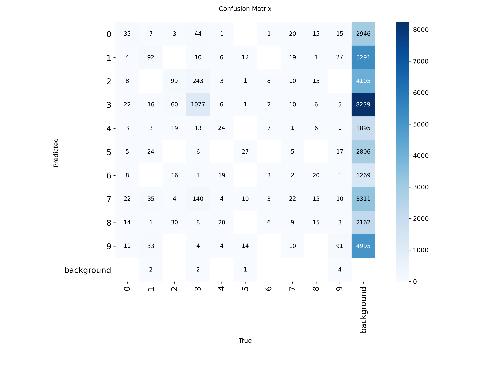

# Edge-YOLO: Localized Vehicle and Urban Hazard Detection in Dense Traffic

**Author:** Aritra Tarafder  
**Institution:** Department of Computer Science & Engineering, World University of Bangladesh  
**Paper:** [Read Full Research Paper (PDF)](Research_Paper.pdf)

---

## 📌 Project Overview
Deploying standard computer vision models directly into dense South Asian urban roadway environments causes severe classification failure due to the absence of localized vehicle categories (e.g., CNG auto-rickshaws) and amorphous hazards like waterlogging. 

This repository presents an edge-optimized vehicle detection pipeline based on **YOLOv8 Nano**. Through domain-specific transfer learning, the pipeline overcomes acute underfitting, achieving high accuracy and ultra-low latency for real-time edge deployment.

---

## 🚀 Key Results
* **Precision ($P$):** 93.24%
* **Recall ($R$):** 87.14%
* **mAP@50:** 94.69%
* **mAP@50-95:** 69.26%
* **Inference Latency:** 4.3 ms per frame (~232 FPS on Tesla T4 GPU)

---

## 📊 Experimental Progression

| Metric / Parameter | Phase 1: Micro Baseline (25 Epochs) | Phase 2: Domain-Augmented Model (30 Epochs) |
| :--- | :--- | :--- |
| **Dataset Scale** | 13 images (Manual Pilot) | 1,287 images (2,682 instances) |
| **Target Categories**| 4 (cng, rickshaw, van, waterlogged) | Localized domain classes (cng, etc.) |
| **Precision ($P$)** | ~0.008 (0.8%) | **0.9324 (93.2%)** |
| **Recall ($R$)** | ~0.110 (11.0%) | **0.8714 (87.1%)** |
| **mAP@50** | <0.01 (0.9%) | **0.9469 (94.7%)** |
| **Operational Status**| Failed Activation (Underfitting) | **Robust Multi-Instance Localization** |

---

## 🔬 Visual Evidence

### 1. Training Convergence & Underfitting Breakdown


### 2. Validation Confusion Matrix


### 3. Real-Time Detection Inference


---

## 🛠️ Tech Stack & Setup
* **Framework:** PyTorch, Ultralytics YOLOv8
* **Hardware:** NVIDIA Tesla T4 GPU (CUDA Accelerated)
* **Dataset Management:** Roboflow Universe Domain Transfer

### Run Inference
```python
from ultralytics import YOLO

# Load weights
model = YOLO("runs/detect/cng_final_model/weights/best.pt")

# Predict on image/video
results = model.predict(source="test_video.mp4", conf=0.25, save=True)
